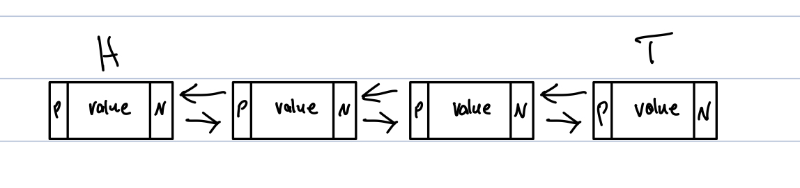
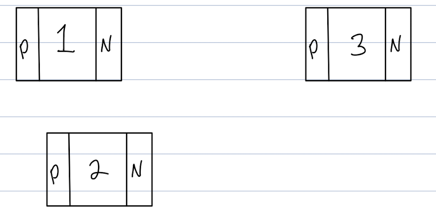
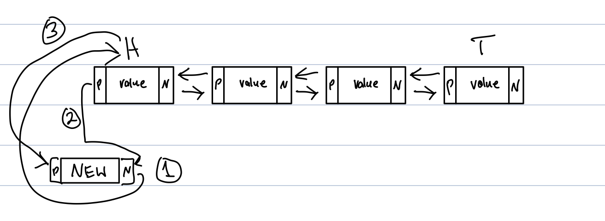

# Linked Lists
* How linked lists work?
* Example code
* Sample problems

## How do linked lists work?
A linked list is more similar to waiting at the DMV. They have codes on the ticket they give you and you can sit anywhere you want. They always know who is next.

A linked list always knows where each item is by using addresses or pointers to the next or the previous node. Everyone is connected.

 

## Using code to represent a linked list
A linked list is constructed by using an object or class. A couple of things must be in the constructer, a head, a tail, and a node. The node must also have their own constructer which includes the data, two pointers, next and previous.

    class LinkedList:
    """ Constructing linked list object by creating the head and the tail 
    """
        class Node:
        """ A object within LinkedList to hold the value and the addresses of next and prev """
            def __init__(self, data):
                self.data = data
                self.next = None
                self.prev = None

    def __init__(self):
        self.head = None
        self.tail = None

A list of values, but constructed as nodes with a previous, next, head, and tail. 
In reality it may look like this.

The values are not in a perfect list. The previous and next addresses keep track of where things are.

In order to keep everything addressed correctly, when inserting or deleting the previous and next needs to be adjusted for the given node.

## Inserting into a linked list
In order to insert into a linked list, certain steps must be made. Once a connection is removed then the address is gone.

1. Set `self.new_node.prev` equal to `self.node`
1. Set `self.new_node.next` equal to `self.node.next`
1. Set `self.node.next.prev` equal to `self.new_node`
2. Sel `self.node.next` equal to `self.new_node`

It is important to follow these steps. You first want to attach the new node to everything before replacing the connections the current node has. 

Example of inserting at the head. Same steps but setting the head equal to the new node.

## Removing a node
The same caution should be taken when removing a node.

1. Set `self.node.next.prev` equal to `self.node.prev`
2. Set `self.node.prev.next` equal to `self.node.next`

## Performace of linked lists
Dealing with the front of the end of the list it will always be O(1). Because the head and tail addresses are in memory.

Inserting or deleting from the middle will be O(n) because you still need to search for the node you are dealing with.

## Sample problems
