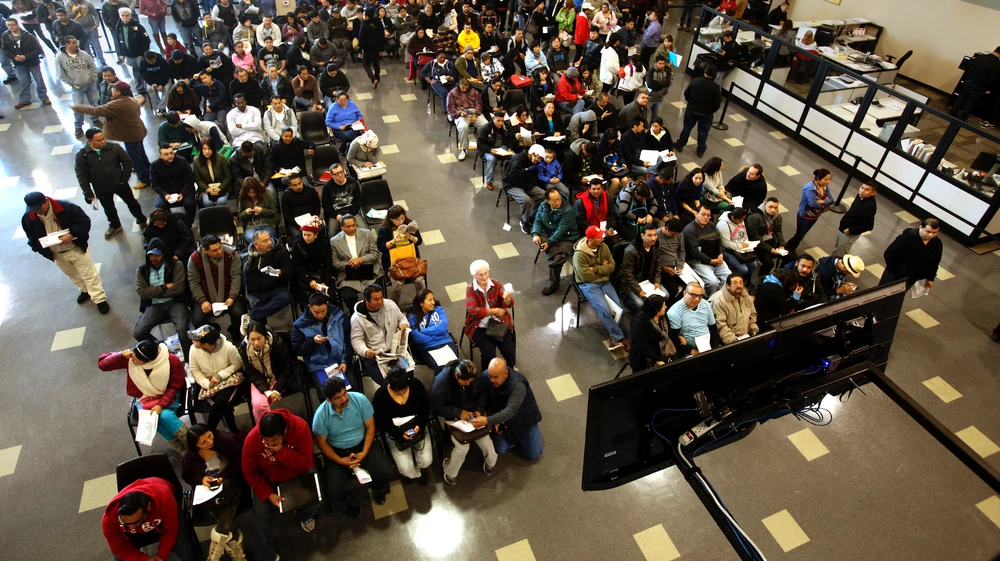

# Linked Lists
* How linked lists work?
* Example code
* Sample problems

## How do linked lists work?
A linked list is more similar to waiting at the DMV. They have codes on the ticket they give you and you can sit anywhere you want. They always know who is next.

A linked list always knows where each item is by using addresses or pointers to the next or the previous node. Everyone is connected.

 

## Using code to represent a linked list
A linked list is constructed by using an object or class. A couple of things must be in the constructer, a head, a tail, and a node. The node must also have their own constructer which includes the data, two pointers, next and previous.

