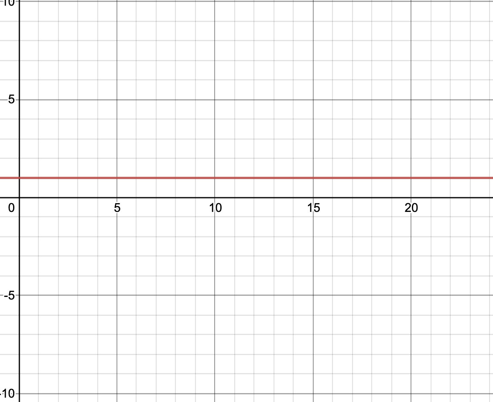
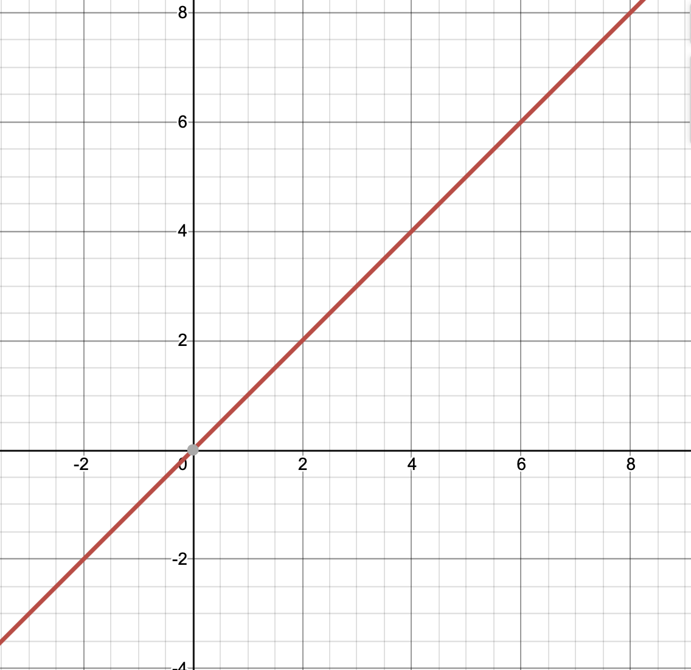
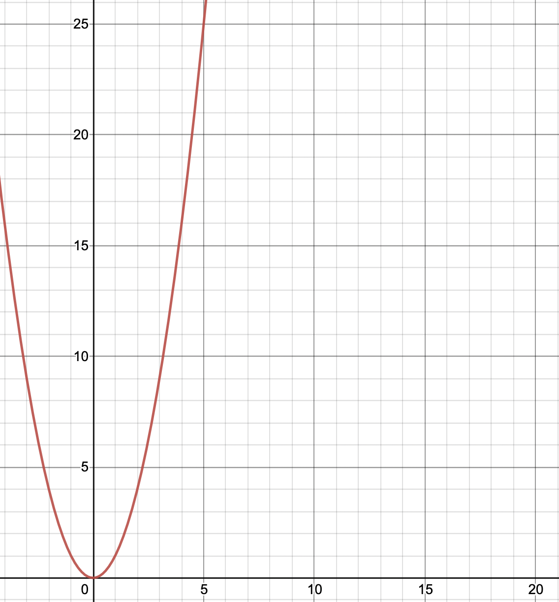
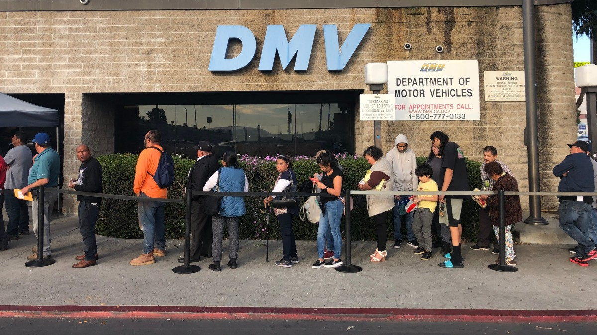

# Queues
* Big O Notation
* How queues work?
* Code
* Problem

## Big O Notation
Before we go over queues, we need to understand the Big O

The big o referes to how long a function takes to complete on the amount of data given. 

The performance of an algorithim.

Each algorithim can be graphed to represent how long it would take.

### O(1)
When the performace is instant it is O(1). The performace does not change even if the data is extremely large.

### O(n)
'for' loops are always O(n) 'n' being the size of the data.

### O(n)^2
So a loop inside of a loop would be O(n) inside of O(n) which would be O(n)^2

## How do queues work?
Queues are like picking a ticket at the DMV and waiting your turn to be next in line.

When something is added to a queue, it is added to the end of the line waiting it's turn to be reminded that they forgot some documents they needed to take the driver's ed test