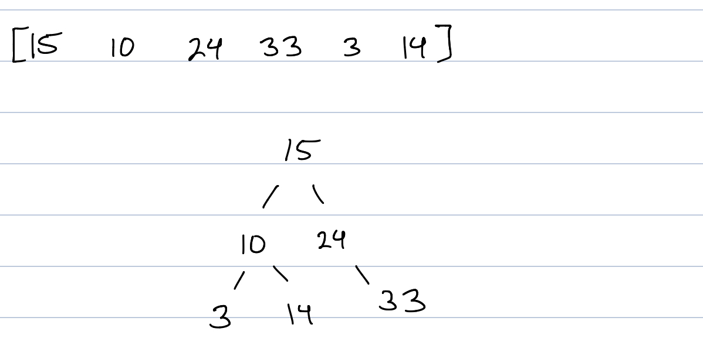
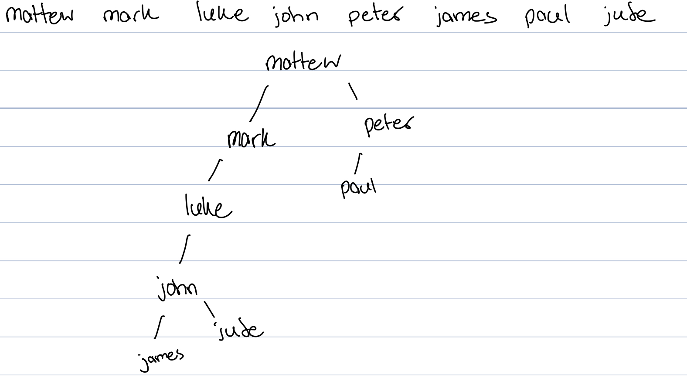

# Trees
* Recursion
* How trees work?
* Example code
* Sample problems

## Recursion

Recusion is like living the same day over and over.

Much like the movie, Groundhog Day, the same function is being called over and over in an infinite loop until something happens.

    def say_hello():  
        print("Hello")
        say_hello()  # This is the recursive call

This code will continue to say hello forever.

It is important when using recursion to have a 'base case'. A base case is when you finally become a good person you are released from the infinite loop. 

In code, a base case is when you set a condition for the function to hit. For example, adding a count.

    def say_hello(count):
	    if count <= 0:  # Base Case
		    return
        else:
            print("Hello")
            say_hello(count-1)  # Smaller Problem

Now the function takes in a number and says 'hello' until the count is reached.

## How do trees work?
Trees are similar to linked lists. Instead of previous and next addresses, trees use right and left. They are also organized differently. 

There is a list in python but in memory it will look like a tree. When setting a tree up, there needs to be rules as to where each value goes. For numbers and for this list, the rules for going left and right are less or greater than.

For this list, the names of some of the apostles are organized by the length of their name. 

When having rules applied to how the tree is organized, it can cut the time to search for something in half. If we wanted to search for 'Luke', we would go down the tree to each node and compare the length. 

You can look at this website to better understand how trees are navigated.
[Tree Demo](https://visualgo.net/en/bst)

## Using code to represent a tree
Setting up an object to represent a tree is similar to a linked list.

    class Tree:
    """ Constructing a tree by makeing the node and the root
    """
        class Node:
        """ A object within LinkedList to hold the value and the addresses of next and prev """
            def __init__(self, data):
                self.data = data
                self.left = None
                self.right = None

    def __init__(self):
       self.root = None

This is when recursion can be help full in searching a tree. No matter which node we are on, the function will do the same thing.

This is an example of how to get the height of a tree.

    def get_height(self, node):
        left = 1 
        right = 1
        if node.left is None and node.right is None:
            return 1
        else:
            if node.right is not None:
                right = self._get_height(node.right) + 1
            if node.left is not None:
                left = self._get_height(node.left) + 1

        if left > right:
            return left
        else:
            return right

The function takes in the node, which will be starting at the root.

Left and right create two variables that are reset to 1 when the function is called. It will keep track of the height.

If the node to the right or left is none then the height is 1.

If the tree is not empty then it will span down both side by calling the function again and adding 1 to the left and right variables.

The decides which one is biggest and returns that number.

[Sample problems](tree_prove.py)