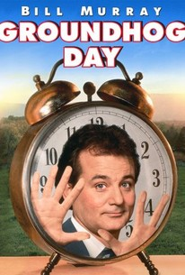

# Trees
* Recursion
* How trees work?
* Example code
* Sample problems

## Recursion
Recusion is like living the same day over and over.

Much like the movie, Groundhog Day, the same function is being called over and over in an infinite loop until something happens.

<code>
def say_hello():   
print("Hello")  
say_hello()  # This is the recursive call
</code>

This code will continue to say hello forever.

